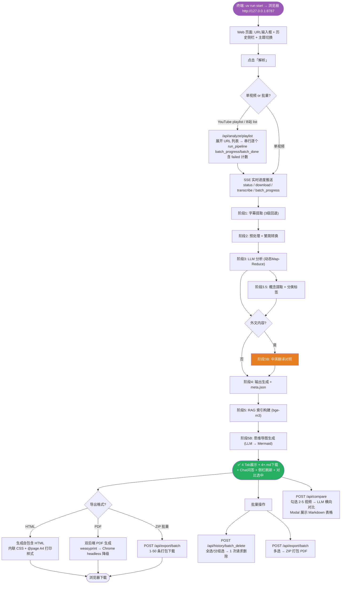
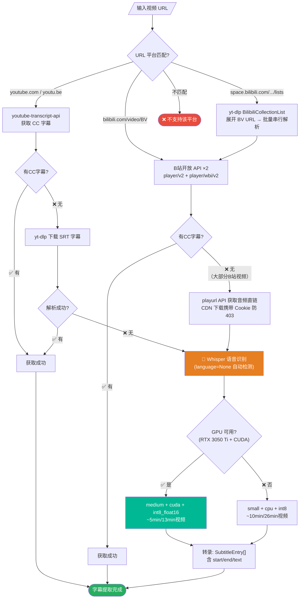
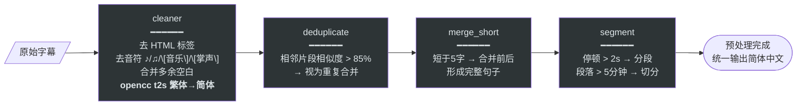
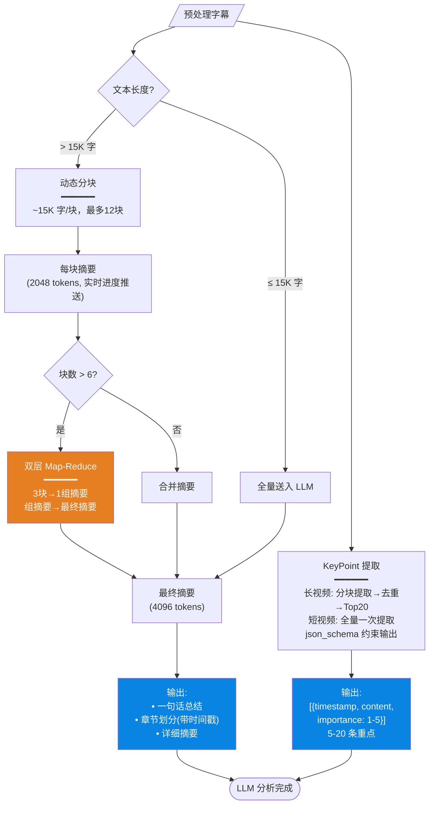
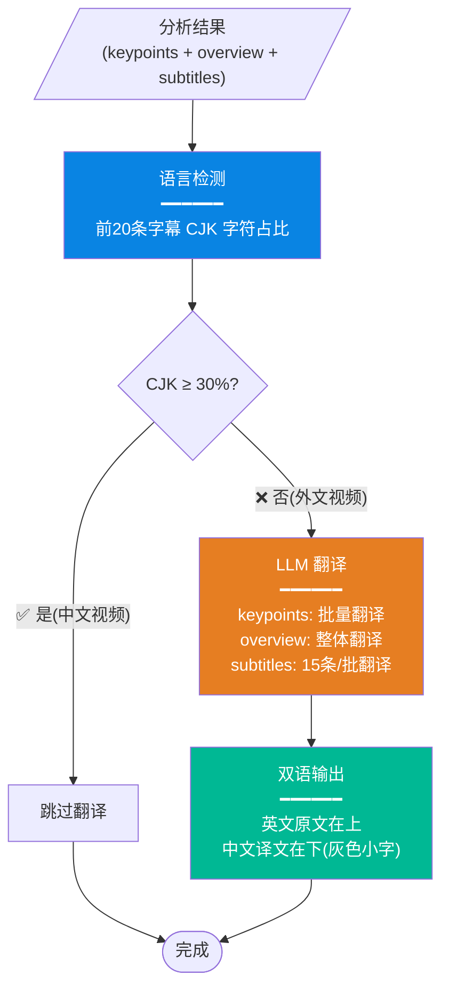
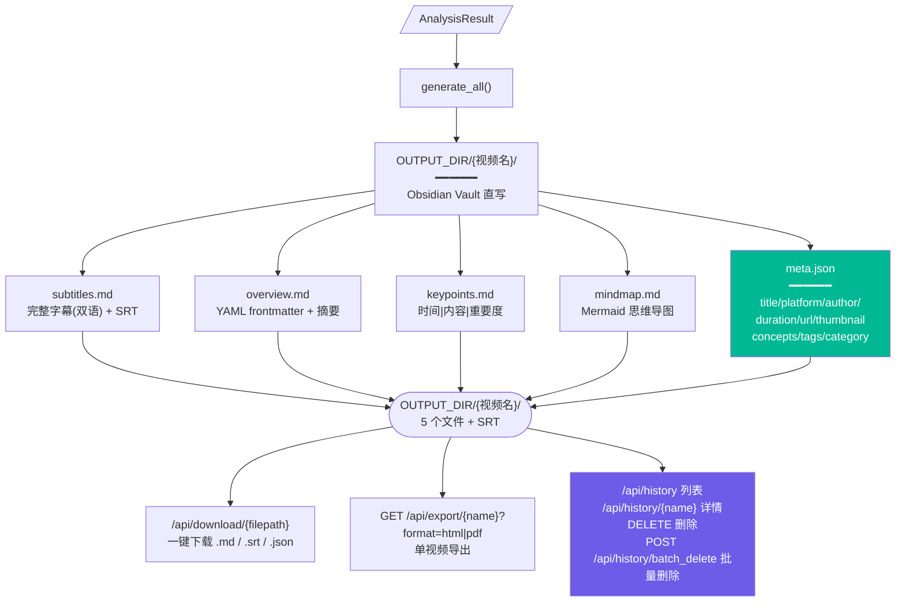
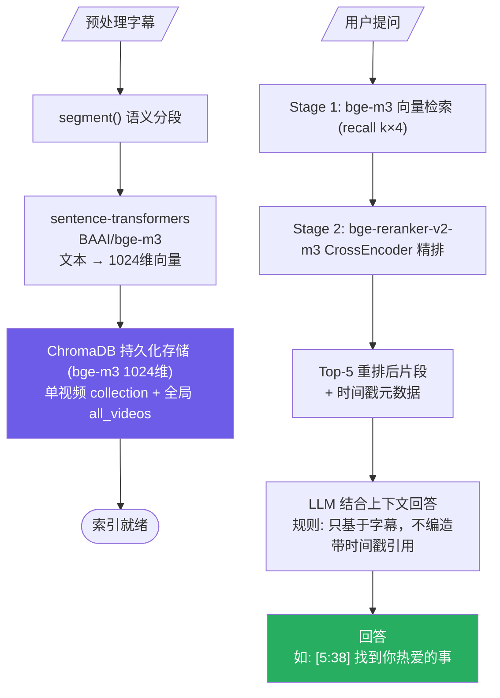
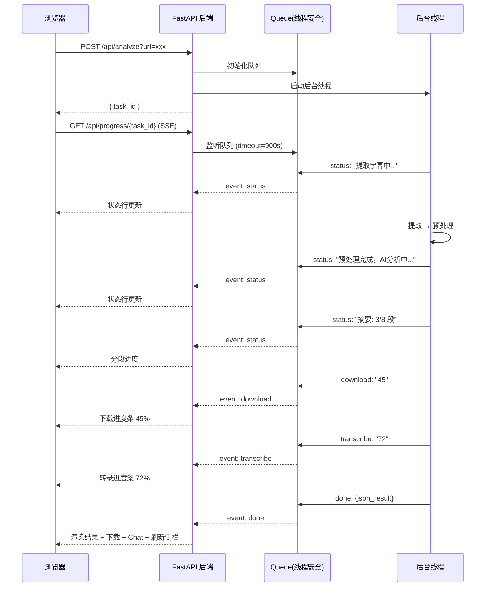
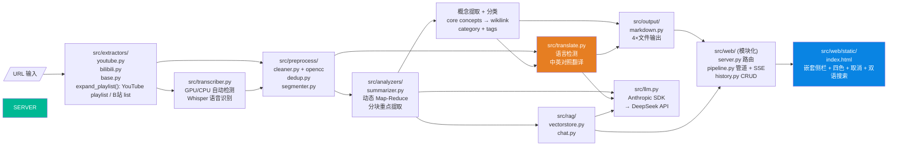

# Video Analyzer 工作流程图

> 最后更新: 2026-06-23 · 更新内容: B站 list 合集批量解析、batch 失败计数、B站音频 Cookie 下载、126测试

## 总览



---

## 一、字幕提取（3 级回退策略）



---

## 二、字幕预处理 + 繁简转换



---

## 三、LLM 智能分析（动态 Map-Reduce）



---

## 三-B、外文翻译对照



---

## 四、输出生成 + 历史持久化



---

## 五、RAG 向量索引 & 问答



---

## 六、Web 实时通信（SSE 事件类型）



### SSE 事件类型

| event | 含义 | 前端行为 |
|-------|------|----------|
| `status` | 阶段状态文本 | 更新 #statusLine |
| `download` | 下载进度百分比 | 显示下载进度条 |
| `transcribe` | 转录进度百分比 | 显示转录进度条 |
| `done` | 单视频分析完成 | 渲染 4 Tab + 下载链接 + 刷新侧栏 |
| `error` | 单视频出错 | 显示错误信息 |
| `batch_progress` | 批量任务进度 | 更新 `done/total`，若 `failed>0` 显示失败数量 |
| `batch_done` | 批量任务结束 | 刷新侧栏；全成功显示绿色，有失败显示红色 |

---

## 七、完整文件路由



---

## 技术栈一览

```
┌────────────────┬─────────────────────────────────────┐
│      层         │              选型                    │
├────────────────┼─────────────────────────────────────┤
│ Web 框架        │ FastAPI + uvicorn                   │
│ 前端            │ 原生 HTML/CSS/JS + SSE EventSource   │
│ 主题            │ CSS 自定义属性 + data-theme 切换      │
│ 字幕提取        │ youtube-transcript-api + yt-dlp     │
│ 语音识别        │ faster-whisper (GPU medium / CPU small)│
│ 繁简转换        │ opencc (t2s)                        │
│ 翻译            │ DeepSeek LLM 批量翻译                │
│ LLM SDK         │ Anthropic SDK → DeepSeek 端点       │
│ 向量数据库      │ ChromaDB (嵌入式, 零运维)             │
│ Embedding       │ BAAI/bge-m3 (1024维)               │
│ RAG 重排序      │ BAAI/bge-reranker-v2-m3 CrossEncoder │
│ 思维导图        │ LLM 生成 → Mermaid.js v10 渲染        │
│ 分类/概念       │ LLM 自动分类标签 + 核心概念提取       │
│ 缓存            │ diskcache (SQLite 后端)              │
│ 配置            │ Pydantic Settings + .env + Obsidian  │
│ 包管理          │ pip                                 │
└────────────────┴─────────────────────────────────────┘
```

---

## UI 布局

```
┌─────────────────┬──────────────────────────────────────┐
│  侧边栏          │         主内容区                       │
│  (可折叠)        │                                      │
│                 │  🌙  Video Analyzer                   │
│ ☑  📋 历史记录 [↻] │  ┌──────────────────────────┐        │
│ ─────────────  │  │ URL 输入框           [解析]│        │
│ ▼ 视频笔记/    │  └──────────────────────────┘        │
│ │ ◆ 3个技能站  │  🟣 [取消] [状态: AI 分析中...]       │
│ │ ◆ 显卡挖矿.. │  [下载音频 ████████░░░░] 45%         │
│ │              │  [语音识别 ██████████████] 78%        │
│ │ ▼ ☑ 📁 3B1B..│                                      │
│ │ │ ◆ Bayes... │  ┌─ 结果 ─────────────────────┐      │
│ │ │ ◆ But_ho.. │  │ [封面] 标题 + 作者 + 时长    │      │
│ │ │ ◆ ...28个  │  │ 一句话总结...               │      │
│ │              │  ├────────────────────────────┤      │
│ ◆ 其他记录     │  │ [重点标示][完整字幕][内容概览][思维导图]│    │
│                │  │ 时间 │ 内容 │ 重要度        │      │
│ [🗑 删除选中] [🔍 对比选中]│  │ 5:02 │ Stay │ ★★★★★      │      │
│ [📕 打包PDF]               │  │      │ 中文翻译(灰色)       │      │
│                │  ├────────────────────────────┤      │
│                │  │ [📥 下载 .md ×3]           │      │
│                │  │ [📄 打印PDF] [📕 下载PDF] [📦 导出HTML]│      │
│                │  ├────────────────────────────┤      │
│                │  │ 💬 对视频内容提问...        │      │
│                │  └────────────────────────────┘      │
└─────────────────┴──────────────────────────────────────┘
```
